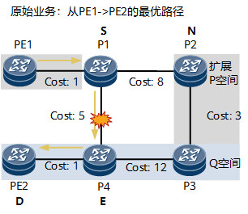

12.2

## 内容

### LFA，remote LFA, TI-LFA

#### 背景

Segment Routing (SR) 是一种现代化的网络路由架构，它简化了网络的配置和管理，并提高了网络的可扩展性和灵活性。SR 通过在数据包头部添加一个有序的段列表（Segment List）来指导数据包的转发路径，每个段代表网络中的一个特定节点或指令。

**核心概念：**

* **段 (Segment):**  段是一个标识符，它代表网络中的一个特定节点或指令。可以是节点的IP地址、MPLS标签或其他标识符。
* **段列表 (Segment List):**  段列表是一个有序的段序列，它定义了数据包在网络中所经过的路径。数据包在转发过程中，会依次经过段列表中指定的节点或执行相应的指令。
* **头端节点 (Head-End):**  头端节点是负责初始化段列表的节点，它将段列表插入到数据包头部，并将其发送到网络中。

tldr: SR 把数据包看作一个快递盒，在开始的时候就把快递盒上贴上了一个有序的标签，然后快递盒就会按照标签上的顺序被送到目的地。

#### LFA

1. 什么是LFA
    LFA（Loop-Free Alternate）是一种快速恢复机制，用于解决网络中的链路故障。当网络中的某条链路发生故障时，LFA 可以快速计算出一个备用路径，以避免数据包陷入环路。LFA 通常是基于拓扑信息和路由表信息计算出来的，它不需要额外的协议支持，因此可以快速部署和实现。

    - 分为链路保护和节点保护

    N为邻居节点，D为目的节点，S为运行LFA计算的源节点，邻居由接口关系定义，直接相连的节点为邻居节点。

    链路保护：

    Distance_opt(N, D) < Distance_opt(N, S) + Distance_opt(S, D) (1)

    > 邻居节点到目的节点最短路不依赖source节点

    节点保护：

    N为邻居节点，D为目的节点，E为主下一跳节点。

    Distance_opt(N, D) < Distance_opt(N, E) + Distance_opt(E, D) (2)

    > 1. 邻居节点到目的最短路不经过割点 2. 实现节点保护要满足1，2两个条件

2. LFA的缺点
    - 不符合上面两个条件的情况下，LFA无法提供保护，会出现备份路径无法使用的情况

#### remote LFA

1. 术语介绍

RLFA & Segment Routing TI-LFA FRR 相关概念

| 概念 | 解释 | 备注 |
|---|---|---|
| P 空间 | 以保护链路源端为根节点建立 SPF 树，所有从根节点不经过保护链路可达的节点集合称为 P 空间。 |  |
| 扩展 P 空间 | 以保护链路源端的所有邻居为根节点分别建立 SPF 树，所有从根节点不经过保护链路可达的节点集合称为扩展 P 空间。 | 华为设备在计算 RLFA FRR 备份路径时，默认计算扩展 P 空间。 |
| Q 空间 | 以保护链路末端为根节点建立反向 SPF 树，所有从根节点不经过保护链路可达的节点集合称为 Q 空间。 |  |
| P 节点 | P 空间或者扩展 P 空间的节点称为 P 节点。 |  |
| Q 节点 | Q 空间的节点称为 Q 节点。 |  |
| PQ 节点 | PQ 节点是指既在（扩展）P 空间又在 Q 空间的节点。 | PQ 节点会作为保护隧道的目的端。 |

2. 计算

- p 空间 

Distance_opt(N, P) < Distance_opt(N, S) + Distance_opt(S, P)

以所有N为源点，不经过保护链路最短路节点的节点集合的并集称为 P 空间、

以所有N为源点，不过S的最短路

N最短路不需要绕S到P

  

证明:
- 对于邻居节点N, 一定是P节点(不等式左侧为零)
- 对于非邻居节点N
    - 充分性: 在不经过保护链路的情况下，以N为原点的最短路上的节点P, Dist(N,P) < Dist(N,S) + Dist(S,P) 显然成立
    - 必要性: Dist(N,P) = Dist(N,S) + Dist(S,P) 不符合

- q 空间
公式四：Distance_opt(Q, D) < Distance_opt(Q, S) + Distance_opt(S, D)

以D为源点的最短路，不过S的点都是Q空间的点

- 建立一个 S 到 PQ 点 的保护隧道，多个随机选

#### TI-LFA
添加 扩展P空间的节点
