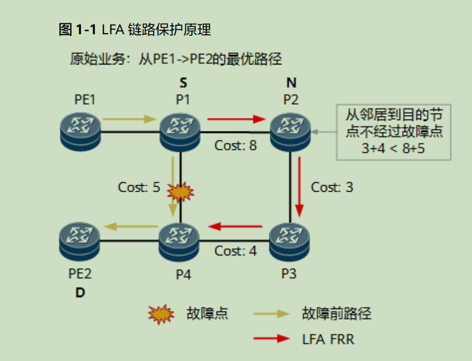
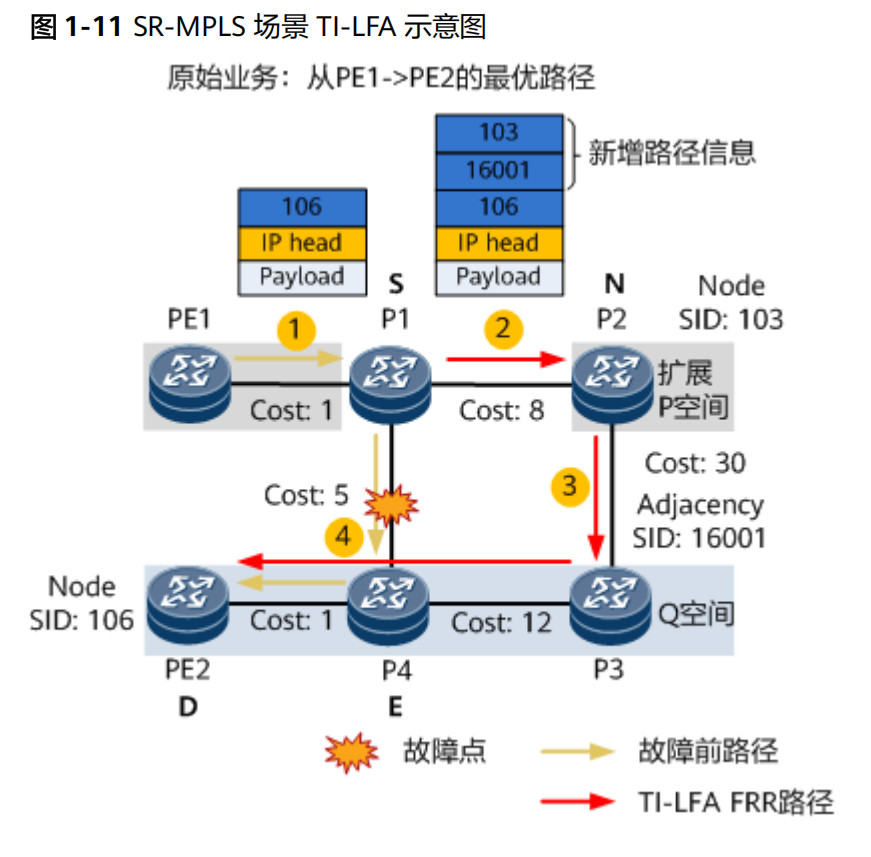

## 12.2 Segment Routing 快速重路由机制

本节讨论 Segment Routing (SR) 中的几种快速重路由机制：LFA, Remote LFA 和 TI-LFA。

### Segment Routing 基础回顾

Segment Routing (SR) 是一种简化网络配置和管理，提高可扩展性和灵活性的新型路由架构。SR 通过在数据包头部添加有序的段列表 (Segment List) 来指导数据包转发，每个段代表网络中的一个特定节点或指令。

**核心概念：**

* **段 (Segment):**  标识网络中特定节点或指令，例如节点的 IP 地址、MPLS 标签等。
* **段列表 (Segment List):**  有序的段序列，定义数据包在网络中经过的路径。
* **头端节点 (Head-End):**  初始化段列表并将之插入数据包头部的节点。

**简单理解:** SR 像在快递盒上贴上按顺序排列的目的地标签，快递按标签顺序送达。

### LFA (Loop-Free Alternate)

#### 1. LFA 原理

LFA 是一种快速恢复机制，用于应对链路故障。当链路故障时，LFA 快速计算备用路径，避免环路。LFA 基于拓扑和路由信息计算，无需额外协议，部署和实现快速。

> 理解： 保护对应与 “如果链路故障，还能通信，不会出现环路” ，即备份路径不会使用故障链路。

  


LFA 分为链路保护和节点保护：

* **链路保护:**  当 S 的邻居节点 N 到目的节点 D 的最短路径不依赖 S 时，N 可以作为 S 到 D 的链路保护节点。公式表示为：

  ```
  Distance_opt(N, D) < Distance_opt(N, S) + Distance_opt(S, D) 
  ```

* **节点保护:** 当 S 的邻居节点 N 到目的节点 D 的最短路径不经过节点 E (S 到 D 的主下一跳节点) 时，N 可以作为 S 到 D 的节点保护节点。公式表示为：

  ```
  Distance_opt(N, D) < Distance_opt(N, E) + Distance_opt(E, D) 
  ```
  节点保护需要同时满足链路保护条件。

#### 2. LFA 缺点

当不满足上述条件时，LFA 无法提供保护，备份路径可能不可用。


### Remote LFA (RLFA)

#### 1. 术语

| 概念          | 解释                                                         | 备注                                                       |
|---------------|--------------------------------------------------------------|------------------------------------------------------------|
| P 空间        | 以保护链路源端为根节点的 SPF 树，不经过保护链路可达的节点集合。     |                                                            |
| 扩展 P 空间    | 以保护链路源端所有邻居为根节点的 SPF 树，不经过保护链路可达的节点集合的并集。 | 华为设备默认计算扩展 P 空间。                             |
| Q 空间        | 以保护链路末端为根节点的反向 SPF 树，不经过保护链路可达的节点集合。     |                                                            |
| P 节点        | P 空间或扩展 P 空间中的节点。                             |                                                            |
| Q 节点        | Q 空间中的节点。                                             |                                                            |
| PQ 节点        | 既在（扩展）P 空间又在 Q 空间的节点。                         | PQ 节点作为保护隧道的目的端。                           |


#### 2. RLFA 计算

* **P 空间:**  满足 `Distance_opt(N, P) < Distance_opt(N, S) + Distance_opt(S, P)` 的所有节点 N 构成 P 空间。  N 到 P 的最短路径不经过 S。

  

* **Q 空间:**  满足 `Distance_opt(Q, D) < Distance_opt(Q, S) + Distance_opt(S, D)` 的所有节点 Q 构成 Q 空间。Q 到 D 的最短路径不经过 S。

* **保护隧道:**  从 S 到 PQ 节点建立保护隧道，多个 PQ 节点时随机选择。


### TI-LFA (Topology-Independent LFA)

TI-LFA 也使用 P 空间和 Q 空间的概念。以 S 为源，D 为目的，计算不经过保护链路的 SPF。将扩展 P 空间和 Q 空间的交点作为路由标记，放入数据包头部，引导数据包沿该路径转发。


